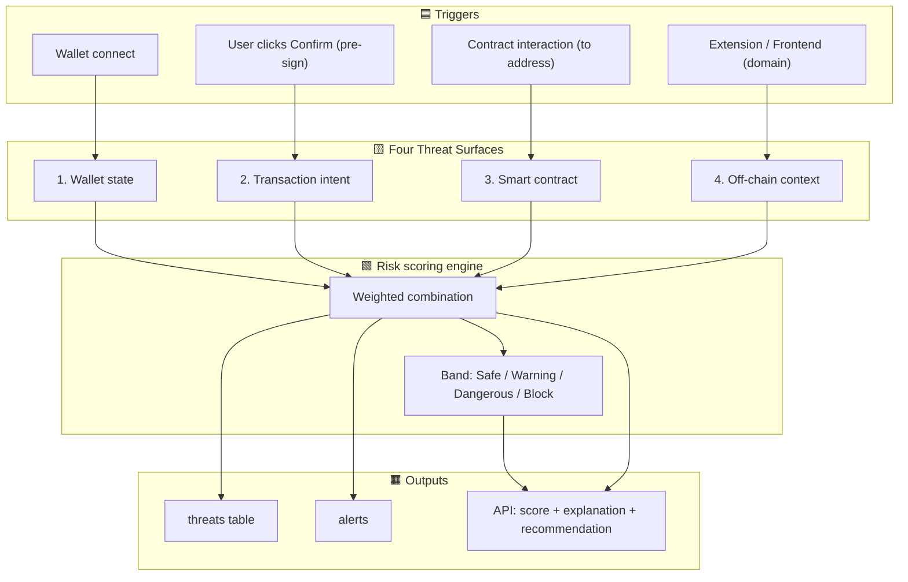
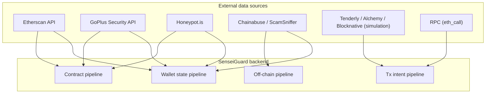
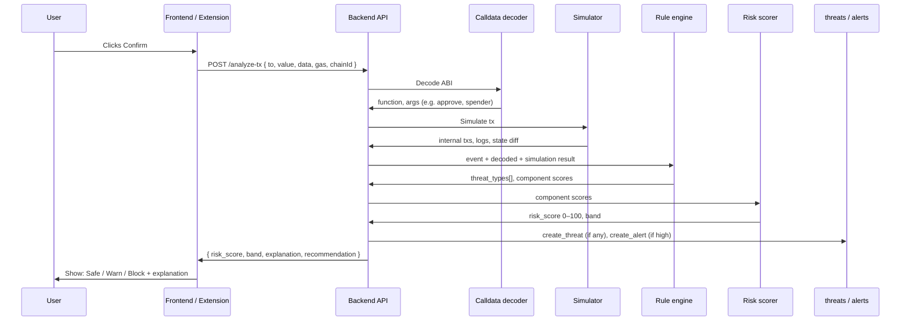
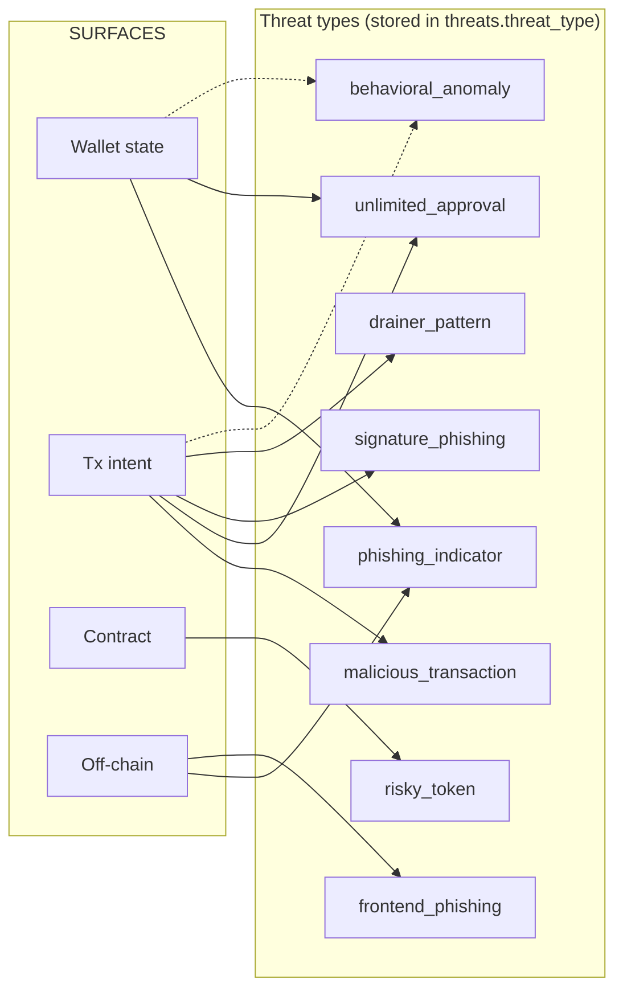
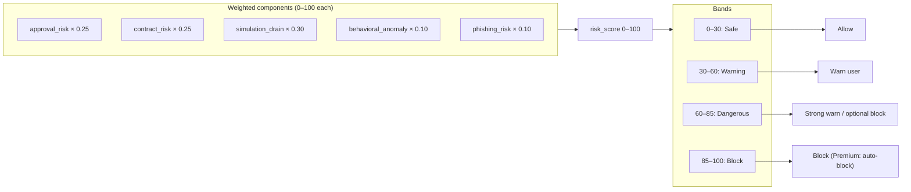
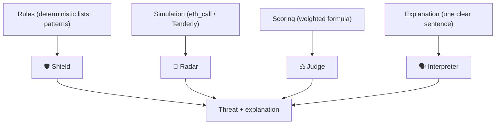

# SenseiGuard™ — Full Threat Detection Architecture

End-to-end flow from user actions to risk score and stored threats. Render this file in any Mermaid-supported viewer (GitHub, VS Code, Notion, etc.).

---

## High-level: Triggers → 4 Surfaces → Risk Engine → Outputs



---

## Detailed: Data flow per surface

```mermaid
flowchart LR
    subgraph TRIGGERS
        A1["Wallet connect"]
        A2["Pre-sign: to, value, data, gas, chainId"]
        A3["Contract address (to)"]
        A4["Domain / URL"]
    end

    subgraph S1["Surface 1: Wallet state"]
        B1["Fetch approvals (ERC20/721)"]
        B2["Check: unlimited? unknown? &lt;24h? no source?"]
        B3["Match vs blocklists"]
        B1 --> B2 --> B3
    end

    subgraph S2["Surface 2: Tx intent"]
        C1["Decode calldata (ABI)"]
        C2["Simulate (eth_call / Tenderly)"]
        C3["Inspect internals, delegatecall, logs"]
        C4["Classify: dangerous fn? drain pattern?"]
        C1 --> C2 --> C3 --> C4
    end

    subgraph S3["Surface 3: Contract"]
        D1["Contract age (&lt;48h?)"]
        D2["Liquidity lock / LP"]
        D3["Owner privileges (mint, pause, rug)"]
        D1 --> D2 --> D3
    end

    subgraph S4["Surface 4: Off-chain"]
        E1["Domain age, SSL"]
        E2["Typosquat (Levenshtein)"]
        E3["URL blacklist, entropy"]
        E1 --> E2 --> E3
    end

    A1 --> S1
    A2 --> S2
    A3 --> S3
    A4 --> S4

    S1 --> SCORE
    S2 --> SCORE
    S3 --> SCORE
    S4 --> SCORE

    subgraph SCORE["Risk engine"]
        SCORE["approval×0.25 + contract×0.25 + simulation×0.30 + behavioral×0.10 + phishing×0.10"]
    end

    SCORE --> THREAT
    SCORE --> API

    subgraph THREAT["Persistence"]
        THREAT["threats (type, surface, explanation, risk_breakdown)"]
        THREAT --> ALERT["alerts (optional)"]
    end

    subgraph API["API response"]
        API["risk_score, band, threat_types[], explanation, recommendation"]
    end
```

---

## External data sources and where they plug in



---

## Pre-sign (transaction lie detector) pipeline — step by step



---

## Threat types and which surface produces them



---

## Risk score bands and actions



---

## Stack roles (from architecture doc)



---

*For implementation details and API shape, see [SENSEIGUARD_ARCHITECTURE.md](./SENSEIGUARD_ARCHITECTURE.md).*
