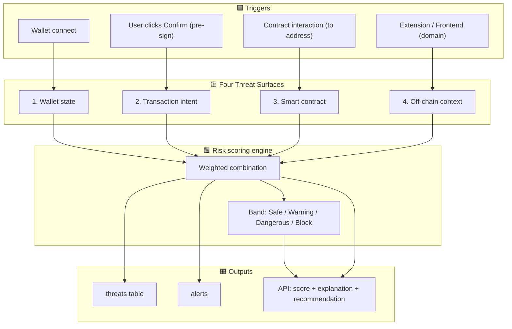
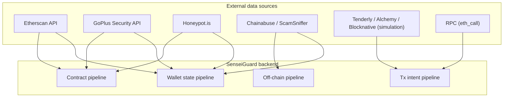
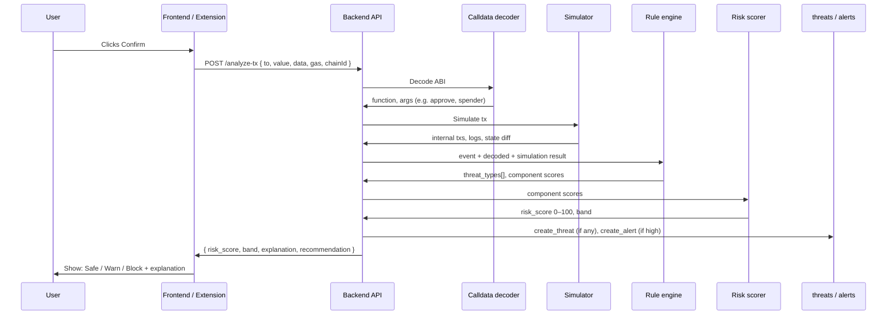
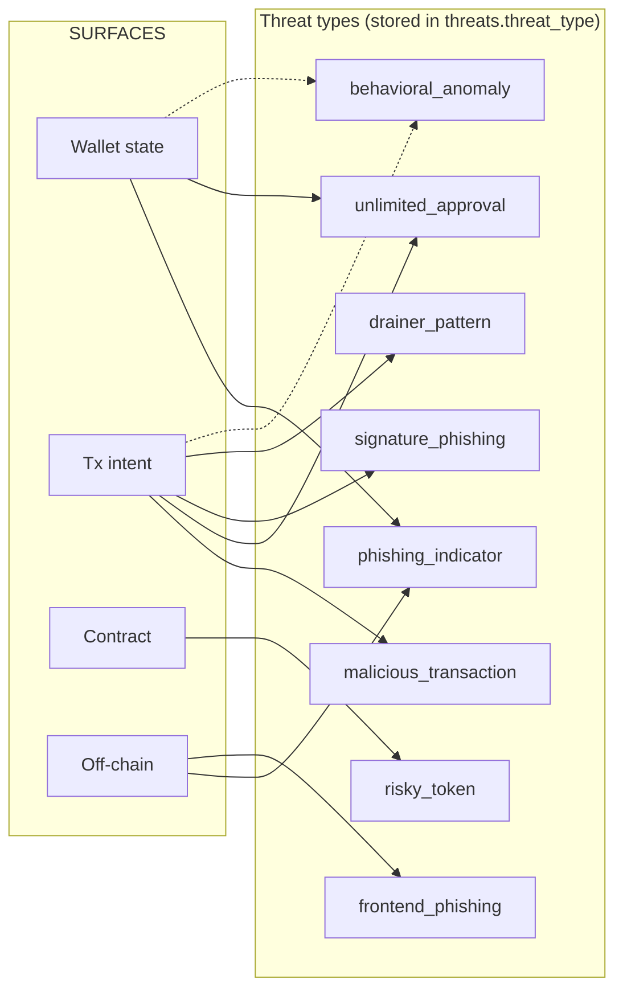
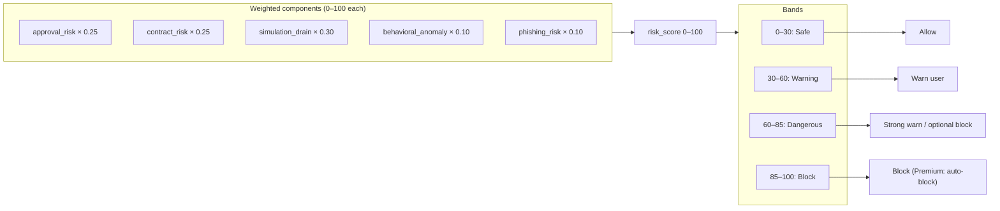
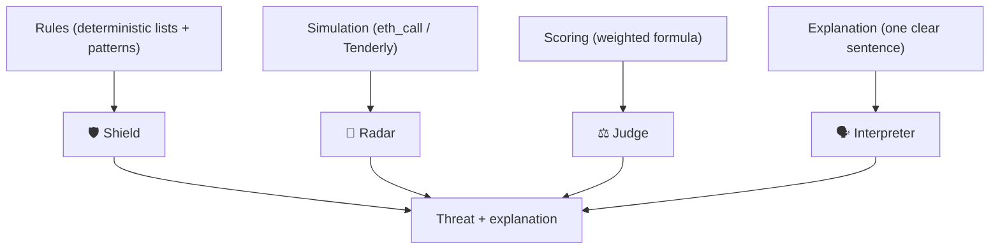
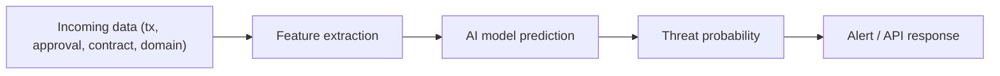

# SenseiGuard™ — Full Threat Detection Architecture

End-to-end flow from user actions to risk score and stored threats. Render this file in any Mermaid-supported viewer (GitHub, VS Code, Notion, etc.).

---

## High-level: Triggers → 4 Surfaces → Risk Engine → Outputs



---

## Detailed: Data flow per surface

```mermaid
flowchart LR
    subgraph TRIGGERS
        A1["Wallet connect"]
        A2["Pre-sign: to, value, data, gas, chainId"]
        A3["Contract address (to)"]
        A4["Domain / URL"]
    end

    subgraph S1["Surface 1: Wallet state"]
        B1["Fetch approvals (ERC20/721)"]
        B2["Check: unlimited? unknown? &lt;24h? no source?"]
        B3["Match vs blocklists"]
        B1 --> B2 --> B3
    end

    subgraph S2["Surface 2: Tx intent"]
        C1["Decode calldata (ABI)"]
        C2["Simulate (eth_call / Tenderly)"]
        C3["Inspect internals, delegatecall, logs"]
        C4["Classify: dangerous fn? drain pattern?"]
        C1 --> C2 --> C3 --> C4
    end

    subgraph S3["Surface 3: Contract"]
        D1["Contract age (&lt;48h?)"]
        D2["Liquidity lock / LP"]
        D3["Owner privileges (mint, pause, rug)"]
        D1 --> D2 --> D3
    end

    subgraph S4["Surface 4: Off-chain"]
        E1["Domain age, SSL"]
        E2["Typosquat (Levenshtein)"]
        E3["URL blacklist, entropy"]
        E1 --> E2 --> E3
    end

    A1 --> S1
    A2 --> S2
    A3 --> S3
    A4 --> S4

    S1 --> SCORE
    S2 --> SCORE
    S3 --> SCORE
    S4 --> SCORE

    subgraph SCORE["Risk engine"]
        SCORE["approval×0.25 + contract×0.25 + simulation×0.30 + behavioral×0.10 + phishing×0.10"]
    end

    SCORE --> THREAT
    SCORE --> API

    subgraph THREAT["Persistence"]
        THREAT["threats (type, surface, explanation, risk_breakdown)"]
        THREAT --> ALERT["alerts (optional)"]
    end

    subgraph API["API response"]
        API["risk_score, band, threat_types[], explanation, recommendation"]
    end
```

---

## External data sources and where they plug in



---

## Pre-sign (transaction lie detector) pipeline — step by step



---

## Threat types and which surface produces them



---

## Risk score bands and actions



---

## Stack roles (from architecture doc)



---

## AI-Based Threat Detection Design (Future / Hybrid)

Modern threat detection increasingly combines **rules + simulation** with **AI/ML** for automatic threat detection. SenseiGuard today is rule- and simulation-based; this section describes how an AI layer fits in so the system can learn normal behavior and detect unknown (e.g. zero-day) threats.

**Key idea:** Detection systems combine **Sensors + Data engineering + AI + Intelligence**.

### Step 1 — Data collection

Large, representative datasets are needed so the model can learn normal vs malicious behavior.

| Domain | SenseiGuard data sources (examples) |
|--------|-------------------------------------|
| Wallet / chain | Wallet state (approvals, balances), transaction history, contract interactions |
| Transaction intent | Pre-sign payloads (to, value, data, gas, chainId), decoded calldata, simulation results |
| Contract | Bytecode, creation code, deployer, age, LP lock, owner privileges, verification status |
| Off-chain | Domain, URL, SSL, referrer, connection timestamps |

The model learns **normal** behavior patterns (e.g. typical approval amounts, typical contract age for legitimate dApps) and flags deviations or known-bad signatures.

### Step 2 — Feature engineering

Raw data is converted into **features** that models can use.

| Category | Example features (Web3) |
|----------|-------------------------|
| Transaction | `tx_value_eth`, `tx_value_usd`, `gas_limit`, `calldata_length`, `function_selector`, `approval_amount_normalized` (e.g. max uint vs finite) |
| Contract | `contract_age_hours`, `is_verified`, `deployer_address`, `bytecode_hash`, `has_proxy`, `owner_privileges_score` |
| Wallet / behavior | `first_interaction_with_contract`, `approval_count_24h`, `unique_dapps_7d`, `wallet_age_days` |
| Reputation | `deployer_drainer_count`, `contract_on_phishing_list`, `bytecode_match_known_family` |
| Off-chain | `domain_age_days`, `domain_entropy`, `typosquat_score_vs_uniswap`, `ssl_valid` |

Feature extraction sits in the **data ingestion** layer (Layer 2 in the defense system doc); the same features can feed both rule engines and AI models.

### Step 3 — Model training

| Approach | Use case | SenseiGuard relevance |
|----------|----------|------------------------|
| **Supervised learning** (Random Forest, Gradient Boosting, Neural Nets) | Trained on **labeled** attack data (e.g. known drainer txs, known phishing domains) | Malware/phishing/drainer classification; threat_type prediction from features. |
| **Unsupervised learning** (clustering, Isolation Forest, autoencoders) | Finds **unknown** threats without labels | Anomaly detection (e.g. behavioral_anomaly); outlier wallets or tx patterns. |
| **Deep learning** (CNN, LSTM, Transformers) | Complex sequences or high-dimensional data | Optional: tx sequence patterns, bytecode/opcode patterns, or cross-surface fusion. |

Models can output **threat probability** (0–1) and/or **classification** (e.g. drainer, phishing, safe), which the Risk Engine can combine with rule-based scores.

### Step 4 — Real-time detection pipeline

AI is deployed in a **streaming** path so every event is scored in real time.



**Example output:**

- Threat probability: **0.92**
- Classification: **Drainer pattern**
- (Optional) risk_breakdown: `{ approval_risk: 20, simulation_drain: 80, model_score: 92 }`

The existing **Risk Engine** can take this probability as an extra component (e.g. `model_risk`) and merge it with approval_risk, contract_risk, simulation_drain, etc., so rules and AI work together.

### Step 5 — Continuous learning

Systems improve over time with:

- **Analyst feedback** — Confirm or reject alerts; use as labels for retraining.
- **New attack samples** — When new drainers/phishing contracts are confirmed, add to training data.
- **Model retraining** — Periodic or triggered retrains to incorporate new labels and samples.

This helps detect **zero-day** and variant attacks that rules have not yet codified.

### Technologies (reference)

Often used in industry for pipelines and AI:

| Layer | Examples |
|-------|----------|
| Data pipelines / streaming | Apache Kafka, Spark Streaming, ETL |
| AI frameworks | TensorFlow, PyTorch, Scikit-learn |
| Visualization / ops | Kibana, Grafana, SIEM platforms |

SenseiGuard today uses a Rust backend, Postgres, and external APIs; an AI layer would plug in as a **feature extraction + model inference** step (e.g. a separate service or in-process model) fed by the same sensors and ingestion that feed the rule engine.

---

## Self-Learning Autonomous Threat Detection AI

Self-learning security AI detects threats **without predefined signatures** by learning “normal” behavior from data and continuously adapting. Instead of rules like traditional antivirus, the AI learns a baseline and flags deviations.

### Core technologies

| Technology | Role |
|------------|------|
| **Unsupervised learning** | Learn normal behavior from unlabeled data; flag outliers (e.g. Isolation Forest, clustering). |
| **Reinforcement learning** | Agents learn optimal response policies (e.g. when to block vs warn) from feedback. |
| **Online learning** | Model updates incrementally as new data arrives, without full retrain. |
| **Behavioral analytics** | Sequence and pattern of actions (e.g. approval → tx → drain) over time. |
| **Deep learning** | Autoencoders, LSTM for sequences, or transformers for complex patterns. |

### Typical architecture

```
Data Sources (SenseiGuard mapping)
   ├── Wallet state / approvals
   ├── Transaction intent (pre-sign)
   ├── Contract / deployer / bytecode
   └── Domain / user activity
        │
        ▼
Feature Extraction Layer
        │
        ▼
Self-Learning Model
   ├── Autoencoders (reconstruction error → anomaly)
   ├── Isolation Forest (outlier score)
   ├── LSTM anomaly detection (sequence deviation)
   └── Reinforcement learning agents (response policy)
        │
        ▼
Threat Scoring Engine
        │
        ▼
Autonomous Response
   ├── Block contract / tx (malicious contract blocking, transaction veto)
   ├── Revoke approval (approval firewall, automatic revocation)
   ├── Isolate (e.g. flag wallet for review)
   └── Alert SOC / user (alerts, dashboard)
```

### Example algorithm flow

1. Collect wallet, tx, contract, and domain data.
2. Extract features (addresses, value, function selector, contract age, deployer, behavior patterns).
3. Train model on **normal behavior** baseline (e.g. typical approval patterns, typical contract age for known-good dApps).
4. Detect anomaly when **reconstruction error** or **outlier score** exceeds threshold.
5. Auto-respond: block, revoke, or alert per policy.

**Pseudocode (conceptual):**

```
model = AutoEncoder()   # or IsolationForest / LSTM

for event in stream:   # tx, approval, contract check, etc.
    features = extract_features(event)
    reconstruction_error = model.predict(features)   # or anomaly_score

    if reconstruction_error > threshold:
        alert("Potential threat")
        # Optional: trigger autonomous response (block, revoke, isolate)
```

Platforms that use similar self-learning approaches in enterprise security include Darktrace, Vectra AI, and CrowdStrike; SenseiGuard would apply the same idea to **Web3** data (wallets, contracts, txs, domains).

---

## Graph-Based Attack Detection Models

Cyber (and Web3) attacks are **relational**: attackers move across entities (wallets, contracts, deployers, domains) and form **attack paths**. Graph models represent these relationships explicitly and detect multi-step and lateral movement.

### Graph representation (Web3 mapping)

| Nodes (entities) | Edges (relationships) |
|------------------|------------------------|
| Wallets | `approval` → contract |
| Contracts | `tx_to` → contract |
| Deployers (EOAs) | `deployed_by` → contract |
| Domains | `connect_domain` → wallet |
| Tokens | `transfer` / `approve` between wallet and contract |

**Example path:**

```
Wallet ──approval(unlimited)──> Contract
Contract ──deployed_by──> Deployer
Deployer ──deployed──> [Known drainer Contract A, B]
Contract ──called_by──> Domain (typosquat)
```

A **graph builder** turns raw logs and chain data into nodes and edges; a **Graph Neural Network (GNN)** or other graph algorithm then scores paths or nodes as suspicious.

### Graph AI techniques

| Technique | Use |
|-----------|-----|
| **GCN (Graph Convolutional Network)** | Aggregate neighbor features; classify nodes or edges (e.g. “is this contract malicious?”). |
| **GAT (Graph Attention Network)** | Weight neighbors by importance; focus on strongest attack signals. |
| **GraphSAGE** | Inductive; generalize to new nodes (e.g. new contract never seen before). |

**Attack path detection:** Identify multi-step intrusions, e.g.:

```
Wallet (victim)
      │
      ▼ approval
Malicious contract
      │
      ▼ deployed_by
Same deployer → [Drainer A, Drainer B]
      │
      ▼ victim_count_24h
Network: 40 wallets drained
```

Graph algorithms (shortest path, subgraph matching, GNN embeddings) can flag such paths even when no single rule fires.

### Example GNN pipeline

```
Security / chain logs
     │
     ▼
Graph Builder (nodes: wallet, contract, deployer, domain; edges: approval, tx, deploy, connect)
     │
     ▼
Graph Neural Network (e.g. GCN, GAT, GraphSAGE)
     │
     ▼
Threat classification (per node or per path)
     │
     ▼
Attack path visualization / explanation
```

### Why graph models are powerful

- **Multi-stage attacks** — One approval may look “normal”; the path wallet → approval → contract → same deployer as 3 drainers is not.
- **Lateral movement** — Track how risk propagates (e.g. one deployer, many contracts, many victims).
- **Hidden relationships** — Deployer–contract–victim clusters that rules might miss.
- **Zero-day** — New contract with no signature can still be risky if its **position in the graph** (same deployer, same bytecode family) is similar to known bad subgraphs.

### Modern hybrid architecture (best practice)

The most advanced systems combine **behavioral self-learning** with **graph-based** attack detection and **threat intelligence**:

```
Data Streams (wallet, tx, contract, domain)
     │
     ▼
Behavior AI (self-learning: normal baseline, anomaly score)
     │
     ▼
Graph Attack Engine (build graph, GNN / path detection)
     │
     ▼
Threat Intelligence Layer (reputation, fingerprint, network campaign)
     │
     ▼
Automated Response (block, revoke, isolate, alert)
```

SenseiGuard’s reputation layer (deployer, bytecode hash, wallet association graph) and network-level detection (clustered victims per contract) are natural **graph inputs**; adding an explicit graph builder and GNN would allow path-based and relationship-based threat scoring alongside rules and self-learning models.

---

*For implementation details and API shape, see [SENSEIGUARD_ARCHITECTURE.md](./SENSEIGUARD_ARCHITECTURE.md).*
